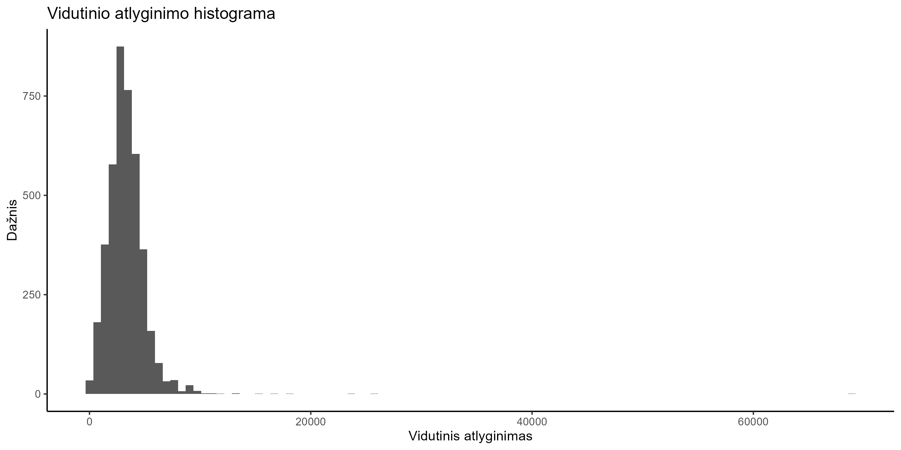
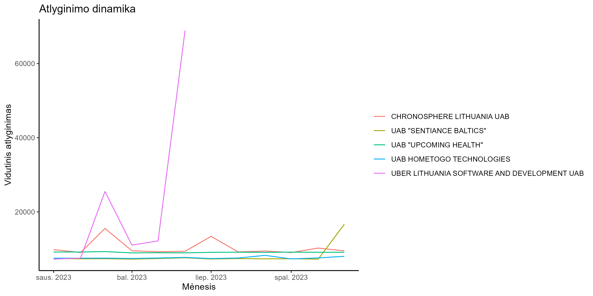
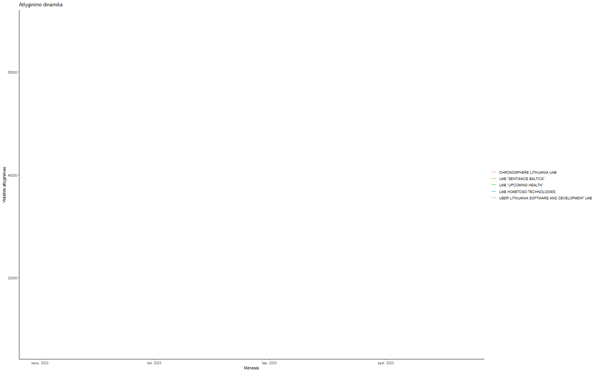
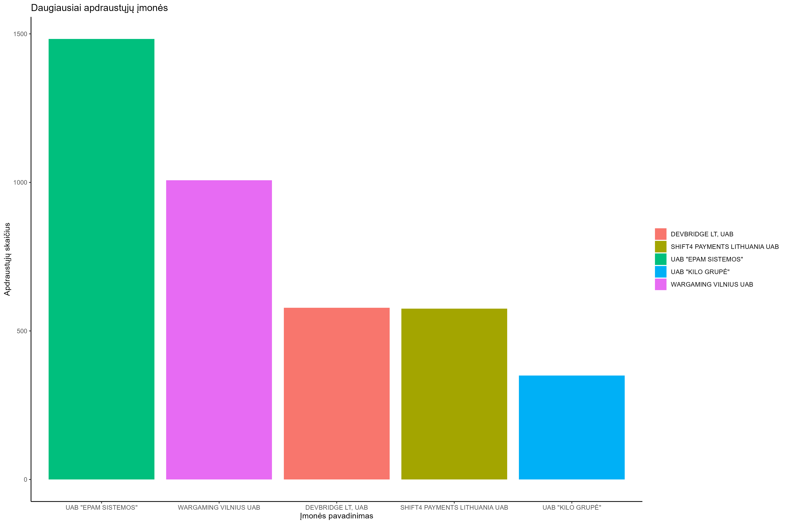
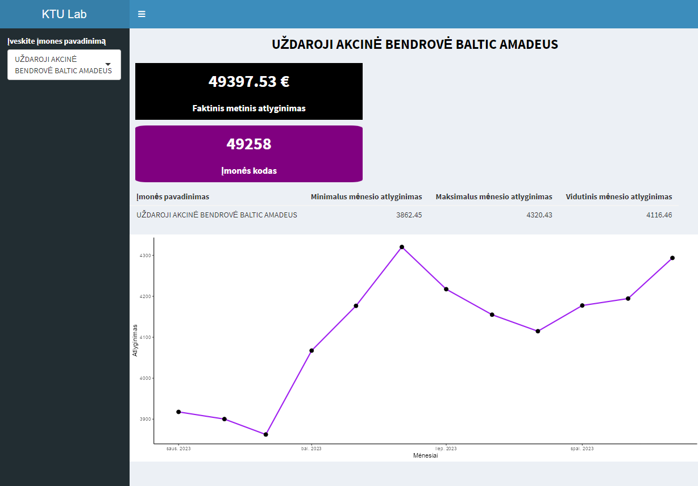

# R Laboratorinis darbas: duomenų vizualizacija

|Variantas | ecoActCode|Formatas          |
|:---------|----------:|:-----------------|
|19         |     620100	|https://atvira.sodra.lt/imones/downloads/2023/monthly-2023.csv.zip|

### 2.1 Užduotis

Atsakymas: 

Išvados: 

Iš histogramos galime pastebėti, kad darbuotojai vidutiniškai per mėnesį uždirba 5000 eurų, tačiau duomenyse yra daug išskirčių - vidutinė alga svyruoja nuo 0 iki 70 tūkst. eurų per mėnesį.

### 2.2 Užduotis

Atsakymas:

Išvados:

Iš diagramos matome, kad daugiausiai per metus uždirbusių įmonių vidutinis mėnesio atlyginimas yra pastovus, apie 10 tūkst. per mėnesį, tačiau vienos kompanijos mėnesio vidurkis siekia net 70 tūkst. (grubi išskirtis)

### 2.3 Užduotis

Atsakymas:

Išvados:

Daugiausiai apdraustų darbuotojų skaičius įmonėje yra 1500, o tai smarkiai skiriasi nuo kitų įmonių vidurkio, nepaisant to antroje ir trečioje vietoje atitinkamai turi 1000 ir 500 apdraustų darbuotojų. 

### 3. Užduotis

Shiny R aplikacijos nuotrauka:

